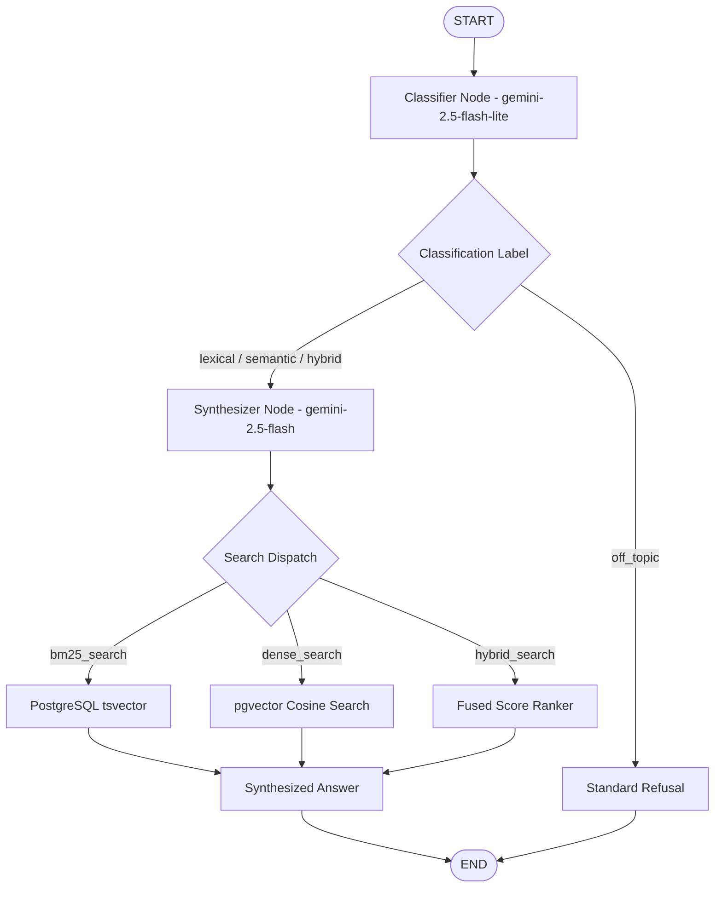

# AGENTS.md

Technical specification and operational guide for autonomous agents in **RAGRoute**.

---

## 1. Multi-Agent Philosophy

RAGRoute separates query understanding from retrieval execution using a **two-agent sequential pipeline** modeled as a LangGraph `StateGraph`:

1. **Classifier Agent (Routing Policy Engine)**: Evaluates user intent, maps it to a retrieval modality, normalizes search strings, and enforces domain relevance.
2. **Synthesizer Agent (Execution & Synthesis Engine)**: Invokes vector and lexical search tools via function calling, grounds retrieved data, and formulates natural-language responses.



---

## 2. Classifier Agent Specification

- **Module**: `src/rag_agent/llms/genai_classifier_agent.py`
- **Model**: `gemini-2.5-flash-lite`
- **Output Constraint**: Strict JSON response schema (no free-form text, no tool calling).

### Responsibilities
- Classify the user query into one of four labels: `lexical`, `semantic`, `hybrid`, or `off_topic`.
- Calculate a confidence score between `0.0` and `1.0`.
- Generate alternative labels with confidence weights.
- Extract a clean, deterministic query string tailored to the target retrieval method.
- Refuse non-wine queries by categorizing them as `off_topic`.

### Structured Output Schema
```json
{
  "type": "object",
  "properties": {
    "label": {
      "type": "string",
      "enum": ["lexical", "semantic", "hybrid", "off_topic"],
      "description": "Primary routing decision."
    },
    "confidence": {
      "type": "number",
      "description": "Confidence score between 0.0 and 1.0."
    },
    "alternatives": {
      "type": "array",
      "description": "Alternative label predictions.",
      "items": {
        "type": "object",
        "properties": {
          "label": { "type": "string" },
          "confidence": { "type": "number" }
        },
        "required": ["label", "confidence"]
      }
    },
    "query": {
      "type": "string",
      "description": "Normalized query string to execute."
    }
  },
  "required": ["label", "confidence", "alternatives"]
}
```

### Deterministic Query Strategies
- **Lexical (`bm25_search`)**: Extract canonical wine labels. If quotes are present, use quoted text verbatim; otherwise strip conversational scaffolding while preserving vintages and capitalization.
- **Semantic (`dense_search`)**: Pass the full, unstripped user query to capture descriptive and emotional phrasing.
- **Hybrid (`hybrid_search`)**: Merge the canonical wine name with high-value semantic descriptors into a compact phrase.
- **Confidence Fallback**: When classification confidence is `< 0.7`, the policy automatically degrades to `hybrid`.

---

## 3. Synthesizer Agent Specification

- **Module**: `src/rag_agent/llms/genai_synthesiser_agent.py`
- **Model**: `gemini-2.5-flash`
- **Tool Calling**: Automatic function calling enabled (`maximum_remote_calls=3`, `mode="AUTO"`).

### Responsibilities
- Inspect the classifier's routing decision from conversation state.
- Call exactly one appropriate tool (`bm25_search`, `dense_search`, or `hybrid_search`).
- Synthesize retrieved results into a concise, grounded natural language answer.
- Strictly adhere to retrieved context and reject ungrounded hallucinations.
- Issue standardized refusals for off-topic queries without calling any tools.

### Available Tools
```python
# Defined in src/rag_agent/utils/tools.py
async def bm25_search(query: str) -> str: ...
async def dense_search(query: str) -> str: ...
async def hybrid_search(query: str) -> str: ...
```

### Standard Refusal Phrase
```text
I am a specialized assistant for wine-review retrieval. I cannot answer questions about other topics.
```

---

## 4. State Management & Lifecycle

- **Module**: `src/rag_agent/utils/state.py`

```python
class State(TypedDict):
    retry_count: Annotated[int, add]
    messages: Annotated[list[BaseMessage], add_messages]
```

### Node Lifecycle
1. **`call_classifier_model`**:
   - Reads `state["messages"]`.
   - Sends query to Classifier Agent.
   - Appends `AIMessage(content="[genai_llm] <json>")` to messages.
2. **`call_synthesiser_model`**:
   - Reads accumulated `state["messages"]`.
   - Executes GenAI chat with tool configuration.
   - Appends synthesized `AIMessage(content="[genai_llm] <answer>")` to state.
   - Routes execution to `END`.

---

## 5. Testing & Verification

Agent behaviors are validated with deterministic tests:
- **Unit Tests** (`tests/unit_tests/test_classifier_unit.py`): Test node outputs against mocked GenAI responses (`FakeResponse`).
- **Integration Tests** (`tests/integration_tests/test_graph_integration.py`): Test sequential state propagation from classifier to synthesizer.
- **E2E Tests** (`tests/e2e/test_graph_e2e.py`): Test graph execution with simulated tool endpoints.
