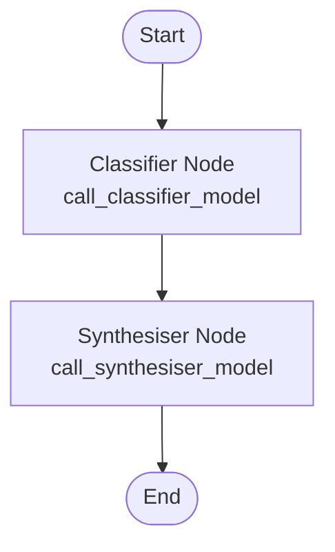

# RAGRoute
# 🍷 Wine Review Retrieval System  
### Dual-LLM Architecture with Classifier + Synthesizer

This project implements a multi-agent Retrieval-Augmented Generation (RAG) pipeline for high-precision wine-review search. It uses two specialized LLMs working in coordination:  
- **Classifier Agent** for query routing and extraction  
- **Synthesizer Agent** for retrieval execution and answer generation

---

## 🧠 Architecture Overview

### Classifier Agent (Gemini 2.5 Flash-Lite)
- Determines retrieval mode: lexical, semantic, hybrid, off_topic  
- Outputs JSON: {label, confidence, alternatives, query}  
- Applies deterministic query extraction rules  
- Falls back to hybrid if confidence < 0.7  

### Synthesizer Agent (Gemini Pro / GPT-4o)
- Executes RAG using classifier label  
- Calls BM25, Dense, or Hybrid retriever  
- Generates grounded answers using retrieved data  
- Enforces strict wine-domain restrictions

---

## 🔍 Deterministic Query Strategy

| Retrieval Type | Query Strategy |
|----------------|----------------|
| **Lexical** | Extract canonical wine label (quoted priority, remove scaffolding) |
| **Semantic** | Use entire user query |
| **Hybrid** | One merged phrase (label + descriptors) |

---

## 🛠️ Technologies
- Gemini 2.5 Flash-Lite  
- Gemini 2.5 Pro / GPT-4o  
- BM25, Dense Embedding Search, Hybrid Retrieval  
- Python tool-calling  

---

## 📦 Usage Flow
1. User query → Classifier  
2. Classifier outputs label + extracted query  
3. Synthesizer selects retriever  
4. Synthesizer returns grounded answer  
5. Off-topic → standardized refusal  

---
## 📦 Diagram

## 🥂 Purpose
A robust, modular, and explainable RAG system optimized exclusively for wine-review retrieval.
