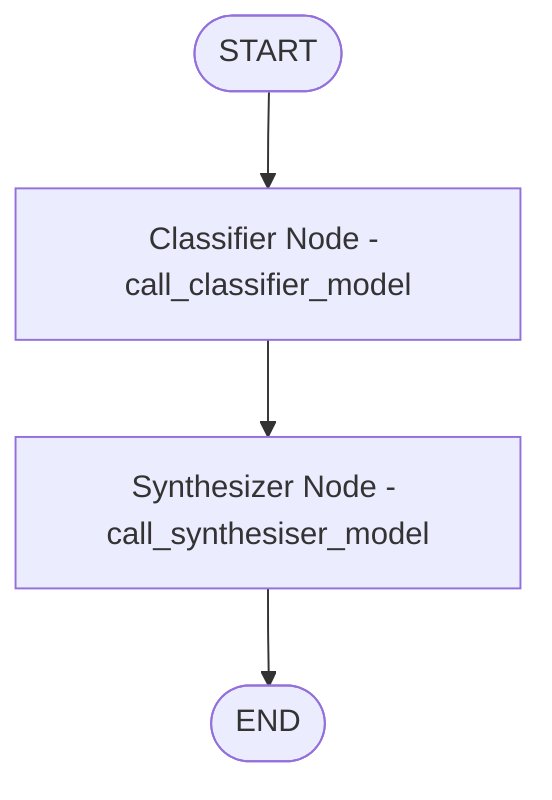

# Architecture & Graph Design

RAGRoute models the wine-review question-answering workflow as a directed LangGraph `StateGraph`. The state propagates conversational messages and control metadata across nodes.

## LangGraph State Definition

The graph state is defined in `src/rag_agent/utils/state.py`:

```python
from operator import add
from typing import Annotated
from langchain_core.messages import BaseMessage
from langgraph.graph import add_messages
from typing_extensions import TypedDict

class State(TypedDict):
    retry_count: Annotated[int, add]
    messages: Annotated[list[BaseMessage], add_messages]
```

- **`retry_count`**: Tracks execution iterations or retries via `operator.add`.
- **`messages`**: Preserves dialogue history and tool outputs using the standard `add_messages` reducer.

## Graph Topology

The graph structure is defined in `src/rag_agent/graph.py`:



## Node Execution Lifecycle

### 1. Classifier Node (`call_classifier_model`)
- Extracts plain text from incoming messages.
- Invokes `gemini-2.5-flash-lite` with structured JSON schema.
- Emits routing parameters: retrieval label, confidence score, alternatives, and sanitized query string.
- Appends the routing decision as an `AIMessage` to the state.

### 2. Synthesizer Node (`call_synthesiser_model`)
- Receives the updated message history containing both user input and the classifier's assessment.
- Activates `gemini-2.5-flash` with tool binding for `bm25_search`, `dense_search`, and `hybrid_search`.
- Executes up to 3 automatic function calls to the vector database.
- Synthesizes retrieved tasting notes into a fluent, grounded final answer.
- Returns a `Command(update=..., goto=END)`.
