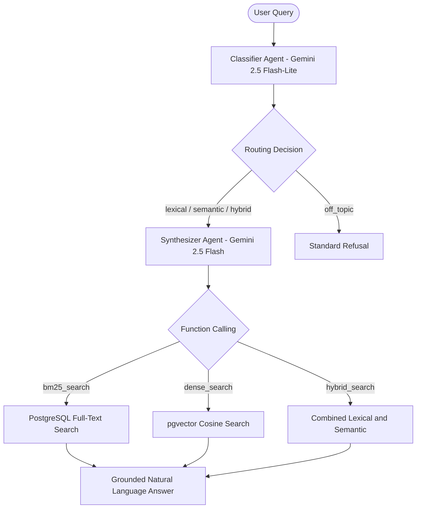

# RAGRoute Documentation

**RAGRoute** is an intelligent, domain-specific Retrieval-Augmented Generation (RAG) system built on LangGraph and Google Gemini. It coordinates specialized autonomous LLM agents to deliver high-precision answers over wine tasting notes and wine metadata.

## Core Highlights

- **Dual-LLM Coordination**: Decouples classification and query normalization from retrieval execution and synthesis.
- **Multi-Modal Retrieval**: Seamlessly selects between lexical (BM25 full-text search), semantic (pgvector cosine similarity), and hybrid search.
- **Strict Domain Guardrails**: Enforces wine-specific knowledge boundaries, rejecting off-topic queries with standardized responses.
- **Deterministic Query Extraction**: Cleans noise and extracts canonical labels for exact matching while preserving context for descriptive inquiries.

## System Workflow

## Quick Start

Get RAGRoute running locally in a few steps:

1. Follow the [Installation Guide](/installation) to set up your environment and database.
2. Explore the [Architecture Overview](/architecture) to understand StateGraph lifecycle and node transitions.
3. Review [Agents & Policy Engine](/agents) to see the prompt policies and structured JSON schemas.
4. Dive into [Retrieval & Vector Search](/retrieval) to learn about the PostgreSQL and pgvector indices.
